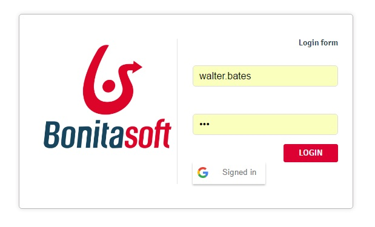

The Google filter can log you in the BonitaPortal is you are log in Google !
Or, a google button "Sign it" is present on the login page. Click on, log in Google and you are log in Bonita Portal.

Two components are available : 
* the login page to update, to include the Google Script to check if you are connected, and to propose you a Google Sign It button
* a filter for the server site. When you are log in Google, a GoogleTokenId is send back by Google. Then, the login page send this TokenId. Filter ask to Google the login name, and then use this login name to log on on the Bonita Portal

a documentation is given to know how to configure page and filter.